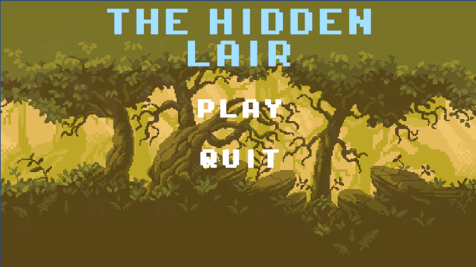
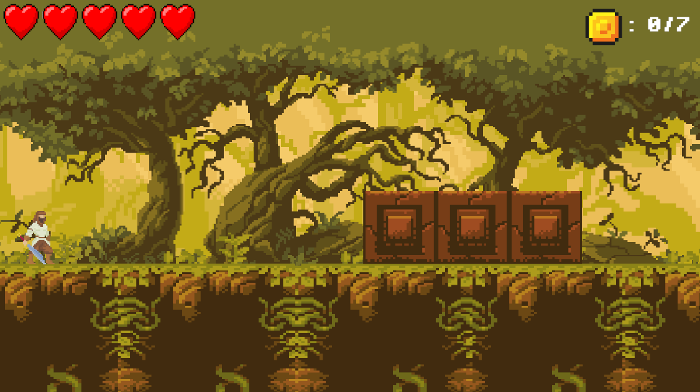
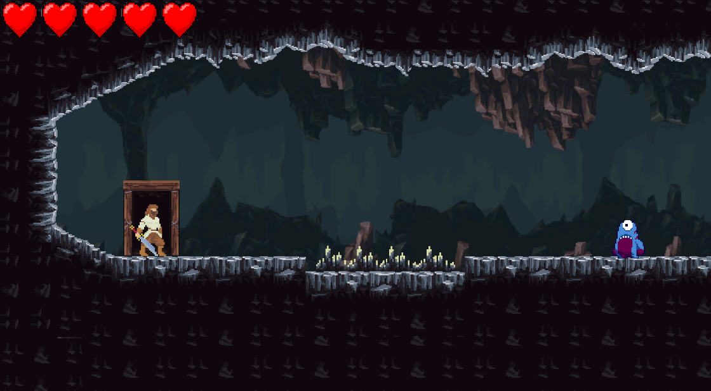
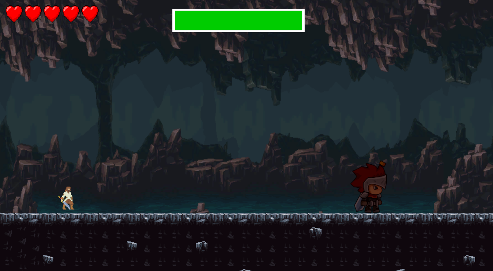

# The Hidden Lair

`The Hidden Lair` is a 2D platformer developed in Unity with C# as a course project for Unity programming. The project was created as part of the seminar work *"Unity - razvoj kompjuterskih igara"* and later polished as a portfolio project.

It is designed as a small but complete gameplay-focused project built around platforming, combat, hazards, progression systems, and a final boss encounter.

## Why This Project

This repository is meant to showcase practical game programming work in Unity. In this project, I worked on:

- player movement and combat systems
- enemy, trap, and boss gameplay logic
- UI, audio, and scene flow
- collectible-based and key-based progression
- debugging and polishing gameplay interactions after the original course version

## Play Online

Once the WebGL build is published, the playable browser version can be found here:

`Itch.io link coming soon`

## Concept

The player starts from the main menu, which contains two basic options:

- `Play` - starts the game from the first level
- `Quit` - closes the application

The core mechanics available to the player are:

- horizontal movement
- jump and double jump
- dash
- melee attack

At the start of each level, the player has `5` health points. If all health is lost, or if the player falls off the map, the current level is reset. After taking damage, the player briefly becomes invulnerable for a short period.

## Level Structure

The game contains three scenes of progression:

### Level 1 - Jungle

The first level serves as an introduction to the game's mechanics. It includes:

- moving platforms
- falling platforms
- spikes
- arrow traps
- patrolling and melee enemies

Enemies can be defeated with melee attacks, and defeated enemies drop coins. There are `7` coins in total, and collecting all of them is required to progress to the next level.

### Level 2 - Cave

The second level takes place in a cave environment and is designed as a more difficult platforming section. The player encounters similar hazards and enemies as in the first level, but the main goal is different: find the key and use it to unlock the door that leads to the final stage.

### Level 3 - Boss Fight

The final level is a boss encounter. The boss constantly follows the player and attacks at close range. While moving, the boss cannot be damaged. Stones fall from the ceiling at timed intervals and serve two purposes:

- they damage the player if they land on them
- they stun the boss if they hit it

The stunned state creates the only damage window for the player. The boss has `10` health points. When it falls to `4` health, it enters an enraged phase, moves faster, and the stones begin falling more frequently and at greater speed.

## What I Implemented

I implemented the complete gameplay loop and supporting systems, including:

- player movement, jump, double jump, dash, and melee combat
- enemy behaviour, enemy damage handling, and health systems
- moving platforms, falling platforms, traps, and death zones
- coin collection and progression logic for Level 1
- key, door, and transition logic for Level 2
- boss movement, boss health, stun logic, enrage phase, and falling stone attacks
- UI flow for health, coins, pause, win screen, and scene transitions
- audio and music integration across levels

I also polished the project further after the course version by fixing gameplay bugs, improving moving platform interaction, stabilizing transitions, and preparing the project for portfolio presentation on GitHub and itch.io.

## Controls

- `Left / Right Arrow` or `A / D` - move
- `Up Arrow` - jump / double jump
- `Left Shift` - dash
- `Space` - melee attack
- `Escape` - pause menu

## Technical Overview

This project was built in:

- Unity `6000.2.10f1`
- C#
- Universal Render Pipeline
- TextMeshPro
- Cinemachine

The project uses Unity scenes, prefabs, colliders, animation, audio, UI canvases, and gameplay scripts for player control, enemy behaviour, level transitions, and boss logic.

## Screenshots

Screenshots from the current build:

## Project Structure

- `Assets/Scenes` - main menu, gameplay scenes, and boss level
- `Assets/Scripts/Player` - player movement, combat, and player-related systems
- `Assets/Scripts/Enemies` - enemy AI, attacks, and traps
- `Assets/Scripts/Platforms` - moving and falling platform logic
- `Assets/Scripts/Boss` - boss movement, boss health, and stone spawning
- `Assets/Scripts/Utils` - game flow, audio, menu handling, scene transitions, doors, and pickups

## Running The Project

1. Open the project in Unity Hub.
2. Use Unity version `6000.2.10f1`.
3. Open `Assets/Scenes/MainMenu.unity`.
4. Press Play in the Unity editor.

## Repository Notes

This repository contains the source Unity project only. Generated folders such as `Library`, `Temp`, `Logs`, `obj`, and `UserSettings` are excluded through `.gitignore`.

## Portfolio Context

Besides the original course implementation, this repository includes post-course cleanup and bug fixing, especially around gameplay flow, moving platforms, scene transitions, and overall project readiness for public presentation.
